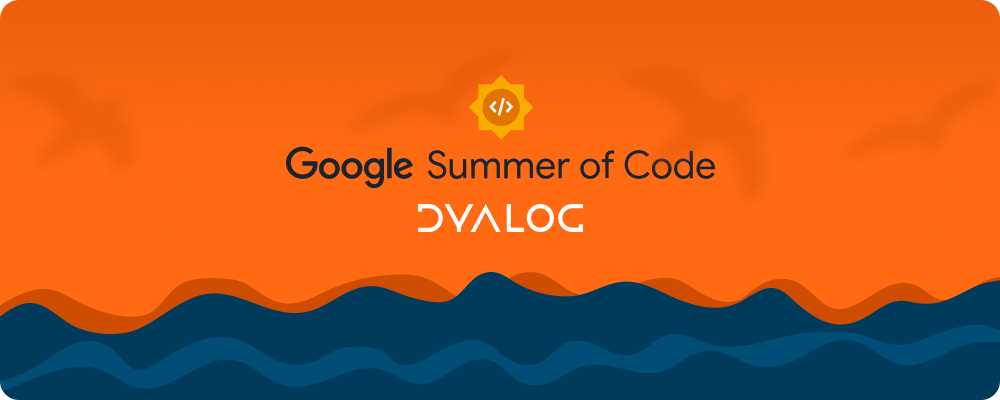

<link rel="icon" type="image/png" href="./assets/favicon-96x96.png" sizes="96x96" />
<link rel="icon" type="image/svg+xml" href="./assets/favicon.svg" />
<link rel="shortcut icon" href="./assets/favicon.ico" />
<link rel="apple-touch-icon" sizes="180x180" href="/apple-touch-icon.png" />
<link rel="manifest" href="./assets/site.webmanifest" />

# Google Summer of Code 2025 Ideas

This page will hold all finalised ideas for Google Summer of Code 2025.

## Finalised Ideas for GSoC 2025

To be annouced! Estimated time for the release of finalised projects is Mid-January 2025

## For discussions and questions:

- Each project idea will have a post in the discussions tab where the idea can be discussed
- There is an open track in the discussions where any interested mentee can add their own ideas and based on our mentor availability we can accept the ideas

## Discussions and Community  

### Community Discussion Channels  
- **[APL Orchard](https://apl.chat)**: A chat room dedicated to learn and teach APL, and to ask and answer questions about both golfing and general coding in APL. 
- **[GitHub Discussions](https://github.com/Dyalog/GSOC-Ideas/discussions)**: Participate in structured discussions about GSoC projects, share your ideas, and engage with mentors and peers.  

### How to Get Involved  
- **Project-specific Discussions**: Each finalized project idea will have a dedicated post in the GitHub Discussions tab. 
- **Open Idea Submissions**: Got your own project idea? Share it in the open discussion track on GitHub. Based on mentor availability, we may guide and accept community-proposed ideas.

## About Dyalog

Dyalog APL is a high-performance implementation of the APL programming language, renowned for its expressive syntax and mathematical elegance. Designed for problem-solving, rapid prototyping, and concise code expression, Dyalog APL is widely used in domains like finance, analytics, and engineering.

Learn more on the Dyalog [Homepage](https://www.dyalog.com) or check out the [Documentation](https://help.dyalog.com).

## Learn Dyalog APL

Whether you're new to APL or an experienced programmer looking to master Dyalog, these resources will help you on your journey:

- [Learning APL by Stefan Kruger](https://xpqz.github.io/learnapl/intro.html): A beginner-friendly resource that introduces APL concepts interactively and intuitively.
- [Mastering Dyalog APL](https://www.dyalog.com/mastering-dyalog-apl.htm): A comprehensive guide to building expertise in Dyalog APL, from basics to advanced topics.

Join the vibrant APL community at APL Orchard to connect with enthusiasts and mentors!

Made with ❤ at Dyalog
